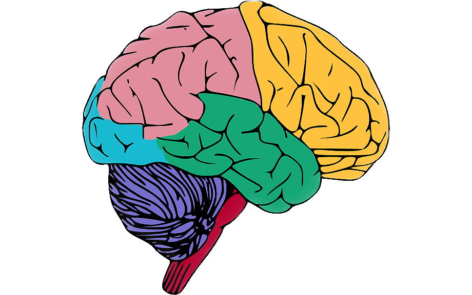

# Resultados

El estudio era bastante complejo y además el cerebro es un órgano también complicado. Podría decir que la elección de los datos inicialmente quizá no fue la adecuada, pues los resultados tampoco han sido muy aclaratorios. 

A modo de resultados, lo que si que he hecho es buscar en páginas/herramientas desarrolladas en exclusiva para el estudio del cerebro y buscar ahí los GENE_SYMBOL que se encontraron con los p-valores más bajos. Sé que a nivel estadístico se tiene que hacer un estudio más exhaustivo para poder comprobar que realmente nos podemos fiar de ese p-valor que a veces tanto quebraderos de cabeza da en ciencia. Dicho esto iré analizando cada uno de los genes en diferentes webs:

**CHAT**

- Web: [https://www.cdtdb.neuroinf.jp/CDT/ReferCDInformation.do?cdid=CD31864]

- Descripción: choline acetyltransferase 

**STRC**

- Web: [https://www.cdtdb.neuroinf.jp/CDT/ReferCDInformation.do?cdid=CD18918]

- Descripción: stereocilin 

**FAD32**

- Web: [https://www.cdtdb.neuroinf.jp/CDT/ReferCDInformation.do?cdid=CD04954]

- Descripción: fatty acid desaturase 2 

**TMEM8C**

- Web: [https://www.cdtdb.neuroinf.jp/CDT/ReferCDInformation.do?cdid=CD16888]

- Descripción: transmembrane protein 8C (componente celular)

**CSNK1G1**

- Web: [https://www.cdtdb.neuroinf.jp/CDT/ReferCDInformation.do?cdid=CD23552]

- Descripción: casein kinase 1, gamma 1 

**NFXL1**

- Web: [https://www.cdtdb.neuroinf.jp/CDT/ReferCDInformation.do?cdid=CD04154]

- Descripción: nuclear transcription factor, X-box binding-like 1 (metal ion binding)

Existen otras dos webs que se nombraron en el resumen del estudio que son : [https://portal.brain-map.org/] y [https://hbatlas.org/]

Esto es una pequeña ayuda, pero también se podría hacer para futuros estudios un enriquecimiento en términos GO con el objetivo de localizar cuáles son los grupos GO más representados en los genes más expresados del contraste. Incluso sería interesante hacer también otros contrastes, por ejemplo, entres hombres y mujeres porque puede que afecta de un modo diferente a unos y otros.

# Conclusión

La búsqueda de genes y sus funciones a partir de Tilling Array que no se había visto ahora ha supuesto un reto, a veces quizá no pudiendo haber realizado las cosas cómo me hubiera gustado. Pero también este estudio ha servido para iniciarme y como siempre enfrentarme a un reto bioinformática e intentar llegar a una solución de la mejor manera posible. No muy contenta con el resultado, también debería tener un conocimiento más amplio del cerebro para poder hacer una conclusión correcta y adecuada. Con esto concluyo este trabajo. 

Agradezco la atención hasta el final y el proyecto está disponible en github. Cualquier sugerencia será siempre bien recibida.

(Enlace proyecto Github)[https://github.com/albavu97/alzheimer_insilico.github.io]

```{r pressure, echo=FALSE, fig.cap="A caption",  fig.width=5, fig.height=6}

```

